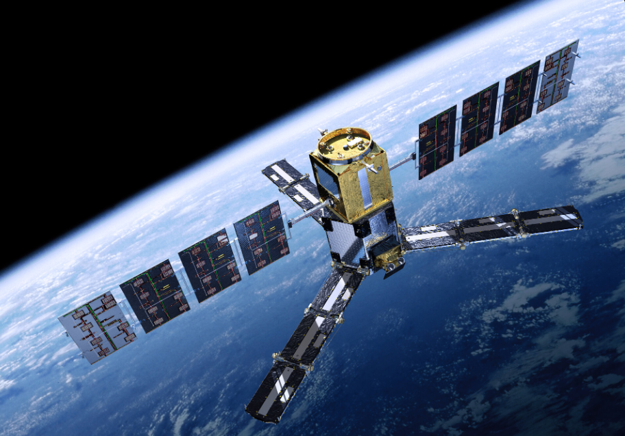
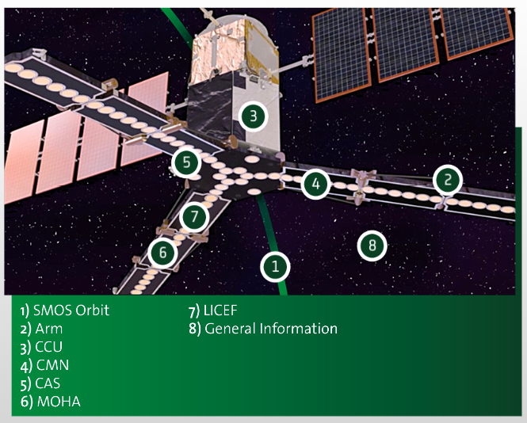
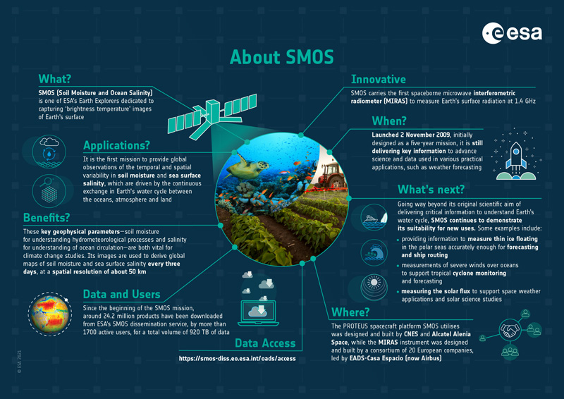

```{r setup, include=FALSE,echo=FALSE}
options(htmltools.dir.version = FALSE)
library(dplyr)
library(readr)
library(readxl)
library(knitr)
```

```{r xaringan-themer, include=FALSE, warning=FALSE}
library(xaringanthemer)
style_duo_accent(primary_color = "#0D5E74", 
                 # secondary_color = "#2881C6",
  header_font_google = google_font("Josefin Sans"),
  text_font_google   = google_font("Montserrat", "300", "300i"),
  code_font_google   = google_font("Fira Mono"),
)
```

```{r xaringan-all, echo=FALSE, warning=FALSE}
library(countdown)
library(xaringan)
library(xaringanExtra)
hook_source <- knitr::knit_hooks$get('source')
knitr::knit_hooks$set(source = function(x, options) {
  x <- stringr::str_replace(x, "^[[:blank:]]?([^*].+?)[[:blank:]]*#<<[[:blank:]]*$", "*\\1")
  hook_source(x, options)
})
xaringanExtra::use_broadcast()
xaringanExtra::use_freezeframe()
xaringanExtra::use_scribble()
#xaringanExtra::use_slide_tone()
xaringanExtra::use_search(show_icon = TRUE, auto_search	=FALSE)
xaringanExtra::use_freezeframe()
xaringanExtra::use_clipboard()
xaringanExtra::use_tile_view()
xaringanExtra::use_panelset()
xaringanExtra::use_editable(expires = 1)
xaringanExtra::use_fit_screen()
xaringanExtra::use_extra_styles(
  hover_code_line = TRUE,         
  mute_unhighlighted_code = TRUE  
)
```

```{r setupbibliography, include=FALSE}
# Code supplied by Andy (see wk2 slides 25-28)
library(RefManageR)
library(knitcitations)
BibOptions(check.entries = FALSE,
           bib.style = "authoryear",
           cite.style = "authoryear",
           style = "markdown",
           hyperlink = TRUE,
           dashed = FALSE,
           no.print.fields=c("doi", "url", "urldate", "issn"))
myBib <- ReadBib("references.bib",
                 # "./Bib.bib", 
                 check = FALSE)
```

class: center, middle

# Soil Moisture and Ocean Salinity
<br> 

**The world's first satellite dedicated to providing global soil moisture and sea water salinity**
<br> 
<br> 

###Yihan Liu


---

# Summary

- Satellite launched by the European Space Agency in 2009 as part of the Earth Probe programme.

- Carried Microwave Imaging Radiometer with Aperture Synthesis instruments.

- Measuring changes in soil moisture and sea water salinity by observing microwave radiation in the L-band.

- Providing global observations of terrestrial soil moisture and ocean salinity.

```{r echo=FALSE, out.width='40%', fig.align='center'}

```
                   <small>SMOS. Source: European Space Agency<small>


---

# Summary

.pull-left[

* Orbit Altitude: Min 761.3 km Max 788.4 km

* Orbit Type: LEO, sun-synchronous, polar, circular, dawn-dusk

* Orbit Inclination: 98.42°

* Repeat Cycle: 149 days, 18 days sub-cycle

]

.pull-right[
```{r echo=FALSE, out.width='150%', fig.align='right'}

```
<br> 
<small>Flight Segment. Source: European Space Agency<small>
]

---

# Summary

```{r echo=FALSE, out.width='70%', fig.align='center'}

```
               <small>SMOS infographic. Source: European Space Agency<small>

The SMOS mission is a direct response to the current lack of global observations of soil moisture and ocean salinity, which are necessary to further our understanding of the water cycle and contribute to improved weather, extreme event and seasonal climate forecasting.

---

## Application

**Observations of sea surface salinity in the western Mediterranean (Olmedo et al., 2018)**

Olmedo et al.(2018) Using SMOS remotely sensed data in combination with debiased non-Bayesian inversion and multifractal fusion techniques, it is possible to obtain an accurate picture of the actual situation of the Mediterranean Sea indicating salinity and to detect areas like the Alboran Sea where land-based marine pollution is particularly severe, providing a scientific basis for a proper understanding of the marine environment. In addition, this technique could be extended to other closed seas affected by strong pollution sources, such as the China Sea, the Baltic Sea and the Black Sea.

---

## Application

**Arctic Ocean sea surface salinities observation (Xie et al., 2023)**

The Barcelona Centre of Expertise has developed a North Sea surface salinity observation product using the SMOS satellite, which, after assimilation experiments designed by Xie et al. (2023), significantly improves the accuracy of the Arctic Ocean Reanalysis System (AORS), thus providing more reliable forecasts of the marine environment. At the same time, it has helped to better understand the water cycle processes in the Arctic, with seasonal variations and distribution of freshwater content, which has important implications for the study of global climate change.

---

# Reflection

* The data provided by SMOS satellites can help to advance our understanding of the Earth's water cycle, climate modelling and climate forecasting. 

* There are challenges in the accuracy of salinity data obtained by satellites from cold regions such as the Arctic, which are now being addressed by scientists who have developed innovative approaches such as non-Bayesian retrieval methods (Xie 2023).

* More and more scientists are now focusing on the study of SMOS data in the ocean system, which holds the promise of further enhancing our understanding of the Earth's water dynamics and improving climate models to address future climate change challenges.

---

# References


<small>European Space Agency (no date) Available at:
https://earth.esa.int/eogateway/missions/smos/description

European Space Agency (no date) Available at: https://earth.esa.int/eogateway/missions/smos#instruments-section

European Space Agency (no date) Available at: https://indd.adobe.com/view/26da113c-173f-485f-a2cd-0eb08b773d57?startpage=5

Xie, J., Raj, R. P., Bertino, L., Martínez, J., Gabarró, C., & Catany, R. (2023). Assimilation of sea surface salinities from SMOS in an Arctic coupled ocean and sea ice reanalysis. Ocean Science, 19(2), 269-287.

Olmedo, E., Taupier-Letage, I., Turiel, A., & Alvera-Azcárate, A. (2018). Improving SMOS sea surface salinity in the Western Mediterranean sea through multivariate and multifractal analysis. Remote sensing, 10(3), 485.<small>


